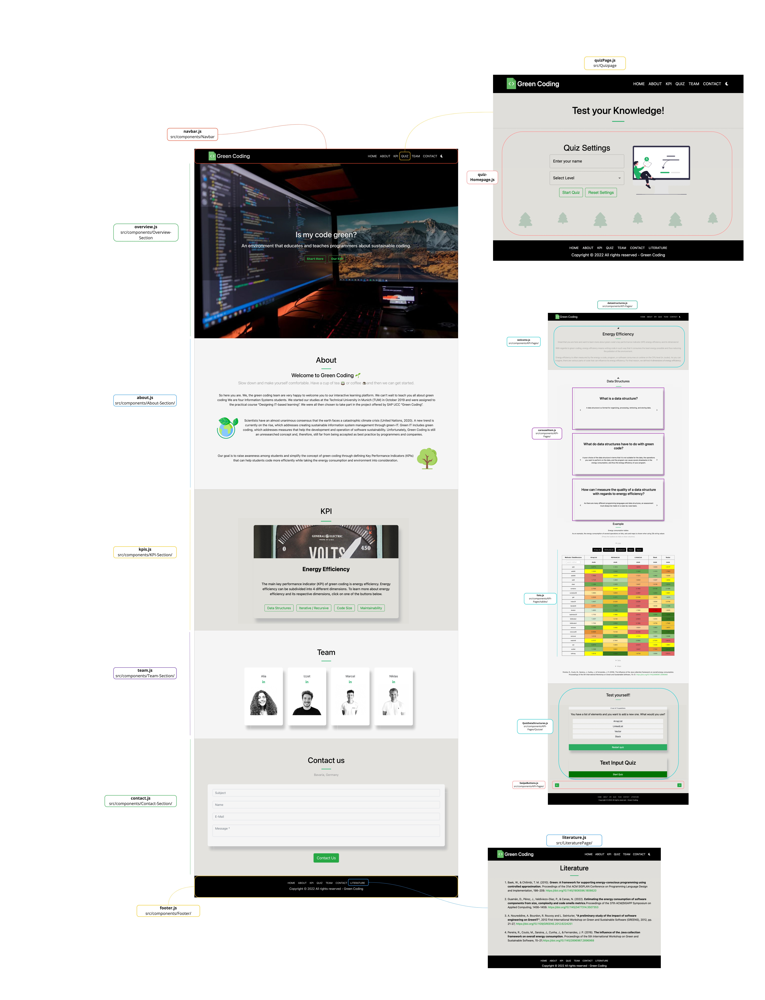

# Documentation Green-Coding Project Implementation

## The structure of the implementation is as follows: 

The **index.js** is the root of the website. All url paths are determined here, as well as our main react component, **home.js** is rendered. 
All content, i.e. the entire website, is rendered in this **home.js** file. 
Our project is divided into 4 folders:
1. Homepage: This folder contains the **home.js** file just mentioned.
2. Quiz page: Here are all the relevant files for the quiz page. The main page can be found in the **quizPage.js** file. This file consists (like all other sub-pages of the navbar, footer) and the actual quiz page, the **quiz-homepage.js**. On this page, all elements (headline, name input field, level dropdown, image, trees and buttons) are implemented. Other files in our current folder are **level1.js** and **level2.js**, which contain the respective page with the quiz. The **quiz-Homepage-Error.js** is the component that appears if you have not entered a name or selected a level on the main page of the quiz page, and then finally the **quizHomepage.css** is in which all design changes have been made.

3. Literature:In this folder you will find **literature.js**, which contains the subpage LITERATURE. All the sources we use on the website are listed here. The **literature.css** is responsible for the design changes in the same way as in the other folders.
4. The most important folder of the project is the **Components** folder: here are the rest of the files for our website. Each section that can be found on our homepage (About, Contact, KPI, Team) is located in a separate folder. Our two most used components, the navbar and the footer, also have their own folder and the largest folder is the **KPI-pages** folder. Here you will find a separate file for each **dimension page** (Data Structures, Codesize etc.). The **Tables** folder contains the implemented interactive tables that can be found on the Datastructure page and our **Quizzes** folder contains all the quizzes that can be found on the respective Dimensions pages in the "Test Yourself" section.

